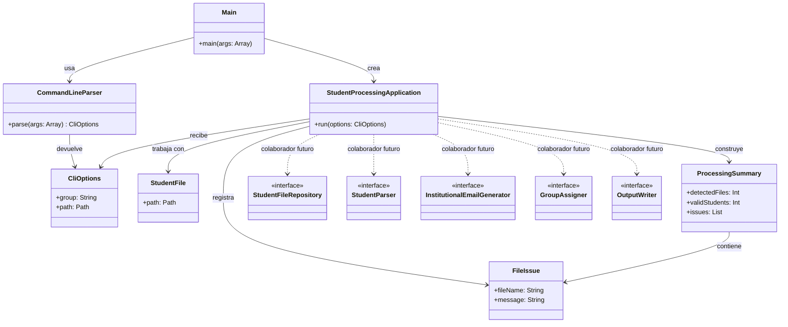
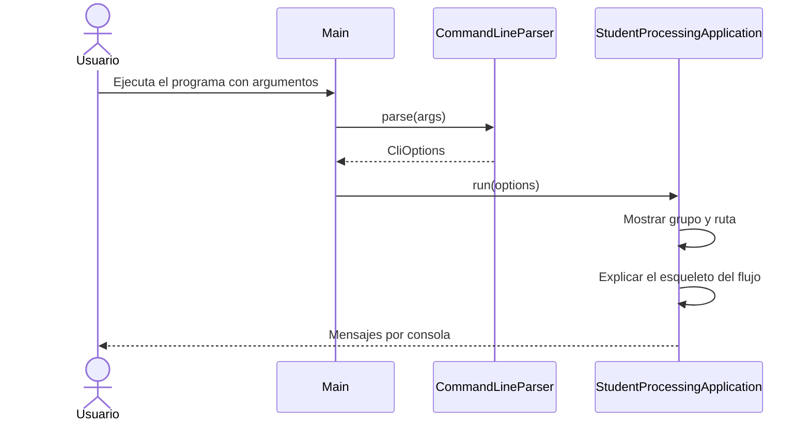

# Planteamiento del Proyecto

## Antes de empezar

Este proyecto está preparado como **base didáctica**.

Eso significa que:

- no está resuelto completo en la rama `main`
- solo tiene hecha la parte del **parseo de parámetros de entrada**
- el resto aparece como **esqueleto** y como **ideas de diseño**

La intención es que no tengas que empezar desde cero, pero tampoco que recibas la solución hecha.

## Qué está hecho y qué no

### Ya está hecho

- La lectura de argumentos de línea de comandos.
- La estructura básica del proyecto Kotlin.
- Una propuesta de organización del programa en orientación a objetos.

### No está hecho todavía

- Leer los ficheros `.txt` del alumnado.
- Extraer los datos de cada fichero.
- Validar los datos.
- Generar el correo del instituto.
- Asignar grupos.
- Escribir los ficheros de salida.
- Mover los ficheros a `procesados`.
- Mostrar el resumen final real.

## Qué se pretende enseñar con esta base

No solo se quiere resolver un ejercicio de ficheros.

También se quiere practicar:

- cómo dividir un problema grande en partes pequeñas
- cómo repartir responsabilidades entre clases
- cómo dar nombre a los objetos del problema
- cómo evitar meter toda la lógica en un único `main`

## Idea principal de orientación a objetos

En programación orientada a objetos no pensamos solo en instrucciones.

Pensamos también en:

- **objetos**: cosas del problema que queremos representar
- **clases**: moldes para crear esos objetos
- **métodos**: acciones que puede hacer un objeto
- **responsabilidades**: qué tarea debe tener cada clase

Una buena idea inicial es esta:

- una clase para leer argumentos
- una clase para coordinar el flujo principal
- una clase para leer ficheros
- una clase para interpretar el contenido de un fichero
- una clase para generar correos
- una clase para asignar grupos
- una clase para escribir salidas

## Por qué no hacerlo todo en `main`

Se podría hacer todo dentro de `main`, pero eso tiene varios problemas:

- el código crecería mucho y sería difícil de leer
- mezclaría tareas distintas en el mismo sitio
- sería más difícil localizar errores
- sería más difícil reutilizar partes del programa

Por eso `main` debería hacer muy poco:

1. crear objetos
2. conectarlos
3. arrancar la ejecución

## Qué papel tiene cada clase de la base

### `Main.kt`

Es el punto de entrada del programa.

Su trabajo es muy pequeño:

- crear el parser de línea de comandos
- obtener las opciones
- crear la aplicación principal
- lanzar la ejecución

Eso está bien hecho así, porque `main` no debería tener demasiada lógica.

### `CommandLineParser`

Esta clase sí está implementada.

Su responsabilidad es:

- leer `args`
- buscar `--grupo`
- buscar `--path`
- validar los valores
- devolver un objeto `CliOptions`

Esto es un ejemplo claro de encapsulación:

- en vez de tener el parseo desperdigado
- lo metemos en una clase especializada

### `CliOptions`

Es una clase de datos.

Solo guarda:

- el grupo principal
- la ruta donde están los ficheros

Este tipo de clases se usa mucho para transportar información entre objetos.

### `StudentProcessingApplication`

Es la clase que coordina el flujo general.

No hace el trabajo final todavía, pero muestra cómo debería organizarse el programa.

Su misión es parecida a la de un director de orquesta:

- no toca todos los instrumentos
- pero sabe cuándo debe intervenir cada uno

En esta base **no usa todavía** las interfaces de `domain/port`.

Eso es intencionado y evita una incoherencia importante:

- las interfaces se entregan como guía de diseño
- todavía no tienen métodos
- todavía no tienen clases que las implementen

Por tanto, la aplicación principal no debe depender aún de ellas para funcionar.

Primero se entiende el reparto de responsabilidades.
Después se implementan las clases concretas.

### `FileIssue`

Es una clase de datos sencilla para representar un problema detectado durante el procesamiento.

Se entrega para que veas que los errores también se pueden modelar como objetos.

### `ProcessingSummary`

Es una clase de datos que representa la idea de "resumen final".

Aunque en la base no se construye todavía un resumen real, sirve para enseñar
que el resultado de un proceso también puede representarse con un objeto.

### `StudentFile`

Representa un fichero de entrada.

Se entrega para mostrar que en orientación a objetos también podemos modelar
elementos del sistema, no solo personas o grupos.

### Interfaces de `domain/port`

Estas interfaces aparecen como **borrador de responsabilidades futuras**.

En esta base:

- no se usan todavía desde `main`
- no tienen métodos todavía
- no tienen implementaciones todavía

Su función es pedagógica:

- ayudarte a imaginar qué piezas podrían existir en una solución completa
- ayudarte a no meter toda la lógica en una sola clase
- mostrar que cada responsabilidad importante podría terminar en una clase distinta

## Diagramas

### Diagrama de clases

Este diagrama no representa una solución completa, sino la **estructura base**
del proyecto y las responsabilidades que ya se quieren dejar claras.

### Diagrama de secuencia

Este diagrama muestra qué ocurre **desde que se ejecuta el programa**
hasta que termina la parte ya resuelta de la base.

## Por qué hay tantas interfaces

Es normal que al principio parezca raro.

Un alumno de primero puede pensar:

> "Si todavía no están implementadas, ¿para qué sirven?"

La respuesta es: **sirven para enseñar cómo separar responsabilidades**.

Una interfaz no guarda datos ni resuelve el problema por sí sola.

Una interfaz sirve para decir:

- qué se espera de una pieza del programa
- qué operación debería ofrecer
- qué papel cumple dentro del sistema

Por ejemplo:

- `StudentParser` sugiere: "debería existir un objeto que sepa convertir un fichero en un alumno"
- `OutputWriter` sugiere: "debería existir un objeto que sepa escribir salidas"
- `GroupAssigner` sugiere: "debería existir un objeto que sepa repartir alumnos en grupos"

Es decir:

- la **interfaz define el papel**
- la **clase concreta haría el trabajo**

## Entonces, ¿voy a usar interfaces ya?

No necesariamente.

Si todavía estás empezando, puedes hacer dos cosas:

### Opción 1: trabajar sin implementar las interfaces al principio

Puedes crear clases concretas directamente, por ejemplo:

- `SimpleStudentParser`
- `SimpleOutputWriter`
- `SimpleGroupAssigner`

Y más adelante, cuando entiendas mejor el diseño, relacionarlas con interfaces.

### Opción 2: usarlas como guía mental

Aunque no las implementes todavía, te ayudan a pensar:

- "necesito una clase para esto"
- "esta otra responsabilidad no debería ir aquí"

Eso ya es útil.

## Qué significa la carpeta `port`

La palabra `port` puede confundir bastante.

Aquí no significa "puerto de red".

En este proyecto se usa con la idea de:

- **punto de conexión**
- **contrato**
- **forma de comunicar una parte del programa con otra**

Puedes entenderlo de una forma sencilla:

- en `port` están las **puertas de entrada y salida** del dominio
- no está la implementación concreta
- solo está la idea de qué necesita el programa

Por ejemplo:

- el dominio necesita "algo" que lea ficheros
- el dominio necesita "algo" que escriba salidas
- el dominio necesita "algo" que asigne grupos

Ese "algo" se expresa con una interfaz.

## Si `port` te lía, quédate con esta idea

Puedes pensar simplemente esto:

- `port` = "interfaces del proyecto"

No necesitas saber más para empezar.

## Una duda importante: por qué los `port` están vacíos

Ahora mismo, en la base del proyecto, los `port` aparecen como interfaces sin métodos.

Eso está hecho así a propósito para que primero se entienda la idea general:

- hay distintas responsabilidades
- cada responsabilidad podría vivir en una clase distinta
- la aplicación principal no debería hacerlo todo

Pero técnicamente, si quieres usar de verdad una interfaz, esa interfaz normalmente
debe declarar **qué operaciones ofrece**.

Dicho de forma sencilla:

- una interfaz vacía solo señala que "aquí debería haber una pieza del sistema"
- una interfaz con métodos ya define "qué puede hacer esa pieza"

Por tanto, sí:

- en una solución más avanzada
- o en una siguiente fase del ejercicio

lo normal sería que esos `port` tuvieran métodos.

Pero no hace falta que ya los tengan en esta base para que el planteamiento tenga sentido.

Aquí se entregan vacíos de manera intencionada para no adelantarte la forma concreta
de resolver cada parte del ejercicio.

## Entonces, para qué sirven ahora

Sirven como guía de diseño.

Te ayudan a responder preguntas como estas:

- ¿quién debería leer los ficheros?
- ¿quién debería interpretar un fichero y convertirlo en un objeto?
- ¿quién debería generar el correo del instituto?
- ¿quién debería decidir el grupo final?
- ¿quién debería escribir los ficheros de salida?

Aunque todavía no tengan métodos, ya te están marcando que esas tareas
no deberían estar mezcladas dentro de una sola clase enorme.

## Qué pasará más adelante

Cuando empieces a implementar de verdad cada parte, tendrás que decidir:

- qué necesita hacer cada objeto
- qué información necesita recibir
- qué resultado debe devolver

Y en ese momento aparecerán los métodos de cada interfaz.

Por ejemplo, sin entrar en la solución concreta, cada `port` acabará necesitando
alguna operación relacionada con su responsabilidad:

- el de ficheros tendrá operaciones de trabajo con ficheros
- el de parseo tendrá operaciones de interpretación de datos
- el de grupos tendrá operaciones de asignación
- el de salida tendrá operaciones de escritura

La idea importante no es memorizar esos métodos ahora, sino entender que:

> primero identificas responsabilidades, después defines operaciones

## Qué no debes hacer

No conviene definir métodos al azar solo por "rellenar" la interfaz.

Primero hay que tener claro:

- qué responsabilidad tiene esa pieza
- qué necesita el resto del programa de ella

Si no, acabarás creando métodos que luego no encajan bien o que mezclan varias tareas.

## Regla sencilla para pensar un `port`

Hazte esta pregunta:

> Si esta pieza fuese un objeto real del programa, ¿qué tendría que saber hacer?

La respuesta a esa pregunta suele convertirse más adelante en uno o varios métodos.

## Qué debes entender como alumno en este punto

En esta fase del proyecto basta con que te quedes con estas ideas:

- los `port` no están para complicar
- los `port` representan responsabilidades separadas
- una interfaz vacía puede servir como borrador del diseño
- cuando la implementación avance, esas interfaces deberán concretarse con métodos

## Patrones que aparecen aquí, explicados fácil

### 1. Responsabilidad única

Cada clase debería tener una tarea principal.

Ejemplos:

- `CommandLineParser`: parsear argumentos
- `StudentParser`: interpretar un fichero
- `GroupAssigner`: asignar grupos

### 2. Orquestador

`StudentProcessingApplication` actúa como orquestador.

Eso significa que coordina pasos, pero no tiene por qué resolver todos los detalles.

### 3. DTO o clase de datos

`CliOptions` es un ejemplo.

Sirve para transportar información de una clase a otra.

### 4. Interfaz

Una interfaz define qué se espera de una pieza del sistema, sin decir todavía cómo se hace.

## Cómo deberías leer este proyecto

Un buen orden para leerlo es este:

1. `Main.kt`
2. `CommandLineParser.kt`
3. `CliOptions.kt`
4. `StudentProcessingApplication.kt`
5. `domain/model`
6. `domain/port`

No empieces por las interfaces si todavía te bloquean.

Empieza por entender:

- cómo entra el programa
- qué datos necesita
- qué pasos generales va a seguir

## Cómo continuar la implementación

Una forma razonable de seguir es esta:

1. Crear una clase `Student`.
2. Crear una clase `SimpleStudentFileRepository`.
3. Crear una clase `SimpleStudentParser`.
4. Crear una clase `SimpleInstitutionalEmailGenerator`.
5. Crear una clase `SimpleGroupAssigner`.
6. Crear una clase `SimpleOutputWriter`.
7. Ir conectando esas clases desde `StudentProcessingApplication`.

## Consejo importante

No intentes resolver todo de golpe.

Hazlo en pasos pequeños:

1. listar ficheros
2. leer uno
3. parsear uno
4. validar uno
5. generar un correo
6. asignar un grupo
7. escribir una salida
8. repetir para todos

## Qué no debes pensar

No debes pensar:

> "Como hay muchas clases e interfaces, esto es demasiado avanzado para mí."

Lo importante aquí no es memorizar arquitectura.

Lo importante es empezar a entender esta idea:

> un problema grande se resuelve mejor si lo dividimos en objetos pequeños con responsabilidades claras

## Resumen final

Qué debes sacar de este planteamiento:

- `main` no debe hacerlo todo
- una clase puede tener una única responsabilidad
- una interfaz describe un papel dentro del sistema
- `port` es solo una carpeta de interfaces
- el flujo del ejercicio ya está pensado
- tú tienes que completar las piezas que faltan

## Objetivo para ti como alumno

Cuando termines este proyecto, deberías ser capaz de:

- leer argumentos de consola
- organizar un programa en varias clases
- distinguir datos, lógica y salida
- trabajar con ficheros
- diseñar una solución clara y mantenible

Ese es el verdadero objetivo, más allá de que el programa funcione.
