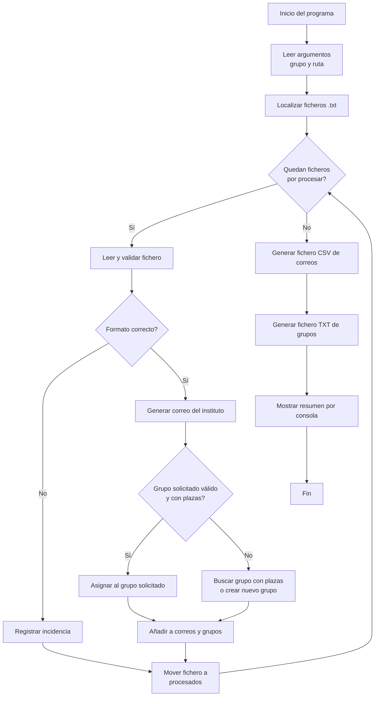

# Actividad unidad 7: Entrada y salida. Lectura y escritura de datos desde consola y ficheros

> Toda la documentación de entrega se realiará en  [ENTREGA.md](./ENTREGA.md)


## Descripción del ejercicio

Aplicación de consola para procesar ficheros de alumnado y automatizar la creación de correos internos y la asignación de grupos del instituto.

Cada alumno entrega un fichero de texto con nombre igual a la parte local de su correo de la Junta de Andalucía, por ejemplo `eferoli398.txt`. Ese fichero incluye:

- Nombre
- Apellidos
- Correo de la Junta de Andalucía
- Grupo solicitado

Ejemplo de fichero de entrada:

```text
Nombre: Jon
Apellidos: Solido Derret
email: jsolder398@g.educaand.es
Grupo = A
```

El programa debe leer todos los ficheros del directorio indicado y realizar este procesamiento:

1. Generar un nuevo correo del instituto con el formato:
   `nombre + primera letra del primer apellido + primera letra del segundo apellido + @iesrafaelalberti.es`
   Si hay apellidos compuestos, se usarán las primeras letras de cada parte, por ejemplo:
   - `Antonio Martinez López Pérez` → `antoniomlp`
   - `Juan García de la Vega Saborio` → `juangdlvs`
2. Guardar los datos de correo en un fichero CSV por grupo del ciclo (`DAW1`, `DAW2`, ...) con nombre `<grupo>-correos.csv`, ej, para DAW1: `DAW1-correos.csv`.
3. Asignar a cada alumno el grupo de clase (`A`, `B`, `C`, ...)  solicitado siempre que no esté completo (Limitar cada grupo de clase a un máximo de 5 integrantes).
4. Si el grupo solicitado está lleno, asignarlo por orden alfabético al siguiente grupo disponible o generar uno nuevo siguiendo las letras del abecedario.
6. Generar un fichero `<grupo>-grupos.txt` con la composición final de los grupos, por ejemplo `DAW1-grupos.txt`.
7. Mover cada fichero procesado a una carpeta llamada `procesados`.
8. Mostrar por salida estándar un resumen del procesamiento.

## Diagrama de flujo



## Descripción del comando

El programa se llamará `procesa-alumnos` y se ejecuta desde línea de comandos y acepta estas opciones: 
- `--grupo <NOMBRE>`: obligatorio. Indica el identificador general del curso o clase, por ejemplo `DAW1`.
- `--path <RUTA>`: opcional. Indica la carpeta donde están los ficheros de entrada. Si no se informa, se usa el directorio de trabajo actual.

Sintaxis propuesta:

```bash
procesa-alumnos --grupo <NOMBRE> [--path <RUTA>]
```

## Ejemplos de uso del comando

Procesar los ficheros del directorio actual:

```bash
procesa-alumnos --grupo DAW1
```

Procesar los ficheros de una carpeta concreta:

```bash
procesa-alumnos --grupo DAW1 --path ./datos/alumnos
```

## Ejemplos de ficheros de entrada

### Ejemplo 1: alumno con grupo informado

Archivo: `jSolDer398.txt`

```text
Nombre: Jon
Apellidos: Solido Derret
email: jSolDer398@g.educaand.es
Grupo = A
```

### Ejemplo 2: alumno con otro grupo

Archivo: `mlopez123.txt`

```text
Nombre: Marta
Apellidos: López Pérez
email: mlopez123@g.educaand.es
Grupo = B
```

### Ejemplo 3: alumno sin grupo válido. Error!!

Archivo: `jruigom777.txt`

```text
Nombre: Javier
Apellidos: Ruiz Gómez de la Serna
email: jruigom777@g.educaand.es
Grupo =
```

## Ejemplos de ficheros de salida

### Fichero de correos

Archivo: `DAW1-correos.csv`

```text
nombre|apellidos|email1|email2
Jon|Solido Derret|jsolder398@g.educaand.es|jonsd@iesrafaelalberti.es
Marta|López Pérez|mlopez123@g.educaand.es|martalp@iesrafaelalberti.es
Javier|Ruiz Gómez de la Serna|jruigom777@g.educaand.es|javiergdls@iesrafaelalberti.es
```

### Fichero de grupos

Archivo: `DAW1-grupos.txt`

```text
[Grupo-A]
- Jon Solido Derret
- Lucía Moreno Gil
- Pablo Torres Díaz

[Grupo-B]
- Marta López Pérez
- Ana Romero Castillo
```

## Resumen esperado por salida estándar

Al finalizar, el programa debe mostrar un resumen similar a este:

```text
Ficheros procesados: 20
Ficheros con errores: 1
Correos creados correctamente: 19

Resumen de grupos:
- Grupo-A: 5 alumnos
- Grupo-B: 5 alumnos
- Grupo-C: 5 alumnos
- Grupo-D: 4 alumnos

Incidencias:
- archivo jruigom777.txt: grupo no informado, error en formato y queda sin asignar a grupo.
```

## Información importante

- Cada fichero debe contener los cuatro datos requeridos.
- Si un fichero tiene errores de formato, debe informarse en el resumen final.
- Los grupos tienen un máximo de 5 alumnos.
- La asignación por orden alfabética debe empezar desde `A` hasta `Z`, asignalo al primero con menos de 5 alumnos. 
- Tras procesar cada fichero, este debe moverse al directorio `procesados`.
- El directorio `procesados` debe crearse automáticamente si no existe.
- El separador del CSV será `|`.


## Preguntas: COMPLEMENTA LAS PREGUNTAS CON ENLACES A CÓDIGO, UTILIZANDO ENLACES PERMANENTES DE GITHUB.

## Preguntas: COMPLEMENTA LAS RESPUESTAS CON ENLACES PERMANENTES DE GITHUB

> [CE 5.a] 1.a. Muestra cómo tu programa recibe y utiliza los argumentos `--grupo` y `--path`.  
Incluye:
- Enlace permanente al código donde se procesan los argumentos
- Breve explicación.
- Ejemplo de ejecución real (comando + salida por consola)

> [CE 5.b] 2.a. Muestra la salida completa por consola tras procesar varios ficheros.  
Explica brevemente y no olvides enlaces permanente al código:
- Qué información muestras: Ejemplo de ejecución real (comando + salida por consola)
- Cómo has estructurado el formato para que sea legible

> [CE 5.c] 3.a. Indica qué clases o métodos has utilizado para trabajar con ficheros y por qué las has elegido.  
Incluye:
- Enlace permanente al código donde se ejemplifica su uso  
- Descripción del código anterior. Porque usas esas y no otras.

> [CE 5.d] 4.a. Muestra cómo interpretas el formato del fichero de entrada y cómo validas que sea correcto.  
Incluye:
- Enlace permanente al código de lectura/validación  
- Descripción del código anterior. Explica cómo validas el formato y qué errores detectas.
- Un ejemplo de error detectado por tu programa y cómo se gestiona. Salida notificándo el error.

> [CE 5.e] 5.a. Breve comentario sobre tu código (añade enlace permanente), acerca de cómo realizas:
- Lectura de ficheros  
- Escritura de resultados (CSV/TXT)  
- Movimiento de ficheros a la carpeta `procesados`  

Incluye un enlace permanente a cada caso y una breve explicación.

## Entrega

El ejercicio se entregará a través de un repositorio de GitHub. El repositorio debe incluir:

- El código fuente de la aplicación, que debe ser funcional.
- `ENTREGA.md` con:
    - Las respuestas a las preguntas de evaluación, usando enlaces permanentes al código utilizado para responder las preguntas de evaluación.
    - Ejemplos de ejecución.
    - Ejemplos a los ficheros de salida tras ejecutar tu programa.

### Comprobación obligatoria de enlaces e imágenes

Es muy importante comprobar la entrega directamente en GitHub después de hacer `commit` y `push`.

Antes de entregar, revisa que:

- Todos los enlaces permanentes a fragmentos de código abren el fichero correcto y las líneas exactas usadas como evidencia.
- Los enlaces permanentes usan una URL asociada a un commit concreto, no a una rama como `main` o `master`.
- Todas las imágenes incluidas en `README.md` o `ENTREGA.md` se ven correctamente desde GitHub.
- No hay enlaces a rutas locales del ordenador, como `C:\...`, `/home/...` o imágenes que solo existen fuera del repositorio.

Puedes consultar la documentación oficial de GitHub sobre cómo crear enlaces permanentes a código en:
[Crear un enlace permanente a un fragmento de código](https://docs.github.com/en/github/managing-your-work-on-github/creating-a-permanent-link-to-a-code-snippet).
