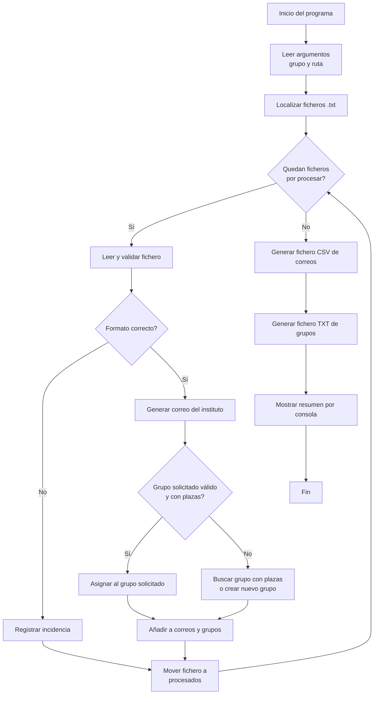

# Acti

> Toda la documentación de entrega se realiará en  [ENTREGA.md](./ENTREGA.md)


## Descripción del ejercicio

Aplicación de consola para procesar ficheros de alumnado y automatizar la creación de correos internos y la asignación de grupos del instituto.

Cada alumno entrega un fichero de texto con nombre igual a la parte local de su correo de la Junta de Andalucía, por ejemplo `eferoli398.txt`. Ese fichero incluye:

- Nombre
- Apellidos
- Correo de la Junta de Andalucía
- Grupo solicitado

Ejemplo de fichero de entrada:

```text
Nombre: Jon
Apellidos: Solido Derret
email: jsolder398@g.educaand.es
Grupo = A
```

El programa debe leer todos los ficheros del directorio indicado y realizar este procesamiento:

1. Generar un nuevo correo del instituto con el formato:
   `primera letra del nombre + segundo apellido + segunda letra del segundo apellido + @iesrafaelalberti.es`
2. Guardar los datos de correo en un fichero CSV por grupo del ciclo (`DAW1`, `DAW2`, ...) con nombre `<grupo>-correos.csv`, ej, para DAW1: `DAW1-correos.csv`.
3. Asignar a cada alumno el grupo de clase (`A`, `B`, `C`, ...) solicitado siempre que sea válido y no esté completo.
4. Si un alumno no indica grupo de clase o el grupo solicitado está lleno, asignarlo aleatoriamente a otro grupo disponible o generar uno nuevo siguiendo las letras del abecedario.
5. Limitar cada grupo de clase a un máximo de 5 integrantes.
6. Generar un fichero `<grupo>-grupos.txt` con la composición final de los grupos, por ejemplo `DAW1-grupos.txt`.
7. Mover cada fichero procesado a una carpeta llamada `procesados`.
8. Mostrar por salida estándar un resumen del procesamiento.

## Diagrama de flujo



## Descripción del comando

El programa se llamará `procesa-alumnos` y se ejecuta desde línea de comandos y acepta estas opciones:

- `--grupo <NOMBRE>`: obligatorio. Indica el identificador general del curso o clase, por ejemplo `DAW1`.
- `--path <RUTA>`: opcional. Indica la carpeta donde están los ficheros de entrada. Si no se informa, se usa el directorio de trabajo actual.

Sintaxis propuesta:

```bash
procesa-alumnos --grupo <NOMBRE> [--path <RUTA>]
```

## Ejemplos de uso del comando

Procesar los ficheros del directorio actual:

```bash
procesa-alumnos --grupo DAW1
```

Procesar los ficheros de una carpeta concreta:

```bash
procesa-alumnos --grupo DAW1 --path ./datos/alumnos
```

## Ejemplos de ficheros de entrada

### Ejemplo 1: alumno con grupo informado

Archivo: `jSolDer398.txt`

```text
Nombre: Jon
Apellidos: Solido Derret
email: jSolDer398@g.educaand.es
Grupo = A
```

### Ejemplo 2: alumno con otro grupo

Archivo: `mlopez123.txt`

```text
Nombre: Marta
Apellidos: López Pérez
email: mlopez123@g.educaand.es
Grupo = B
```

### Ejemplo 3: alumno sin grupo válido

Archivo: `jruiz777.txt`

```text
Nombre: Javier
Apellidos: Ruiz Gómez
email: jruiz777@g.educaand.es
Grupo =
```

## Ejemplos de ficheros de salida

### Fichero de correos

Archivo: `DAW1-correos.csv`

```text
nombre|apellidos|email1|email2
Jon|Solido Derret|jsolder398@g.educaand.es|jderrete@iesrafaelalberti.es
Marta|López Pérez|mlopez123@g.educaand.es|mpereze@iesrafaelalberti.es
Javier|Ruiz Gómez|jruiz777@g.educaand.es|jgomezo@iesrafaelalberti.es
```

### Fichero de grupos

Archivo: `DAW1-grupos.txt`

```text
[Grupo-A]
- Jon Solido Derret
- Lucía Moreno Gil
- Pablo Torres Díaz

[Grupo-B]
- Marta López Pérez
- Ana Romero Castillo

[Grupo-C]
- Javier Ruiz Gómez
```

## Resumen esperado por salida estándar

Al finalizar, el programa debe mostrar un resumen similar a este:

```text
Ficheros procesados: 20
Ficheros con errores: 1
Correos creados correctamente: 19

Resumen de grupos:
- Grupo-A: 5 alumnos
- Grupo-B: 5 alumnos
- Grupo-C: 5 alumnos
- Grupo-D: 4 alumnos

Incidencias:
- archivo jruiz777.txt: grupo no informado, asignado aleatoriamente a C
```

## Información importante

- Cada fichero debe contener los cuatro datos requeridos.
- Si un fichero tiene errores de formato, debe informarse en el resumen final.
- Los grupos tienen un máximo de 5 alumnos.
- La asignación aleatoria solo debe hacerse primero entre grupos con plazas disponibles, luego seguir el orden del abecedario, empezando por `A`, `B`, `C`, ...
- Tras procesar cada fichero, este debe moverse al directorio `procesados`.
- El directorio `procesados` debe crearse automáticamente si no existe.
- El separador del CSV será `|`.

## Objetivo de aprendizaje evaluado

Este ejercicio está orientado a evaluar resultados de aprendizaje relacionados con:

- Lectura de datos desde ficheros de texto.
- Escritura de ficheros de salida en formato texto y CSV.
- Procesamiento de datos desde línea de comandos.
- Gestión de rutas y directorios.
- Movimiento de ficheros una vez procesados.
- Comunicación de resultados e incidencias por salida estándar.

## Preguntas: COMPLEMENTA LAS PREGUNTAS CON ENLACES A CÓDIGO, UTILIZANDO ENLACES PERMANENTES DE GITHUB.

[CE 7.a] 1.a. Describe cómo se ha implementado la lectura de datos desde la consola y la escritura de resultados por consola. Pon ejemplos de código (enlace permanente al código en GitHub).
[CE 7.b] 2.a. Describe cómo se ha implementado la visualización de la información por consola ¿como le has dado formato.? Pon ejemplos de código (enlace permanente al código en GitHub).
[CE 7.c] 3.a ¿Que librería/clases has utilizado para realizar la práctica? Comenta los métodos mas interesantes
[CE 7.d] 4.a ¿Que formato le has utilizado en los ficheros de entrda y salida recuperar y guardar la información respectivamente? 4.b ¿Que facilidades te ha dado tener un determinado  formato adaptado? 4.c ¿Cómo se gestionan los errores? Pon ejemplos de código (enlace permanente al código en GitHub).
[CE 7.e] 5.a Describe la forma de acceso para leer información 6.b Describe la forma de acceso para escribir información 6.c Describe la forma de acceso para actualizar información. Pon ejemplos de código (enlace permanente al código en GitHub).


## Entrega

El ejercicio se entregará a través de un repositorio de GitHub. El repositorio debe incluir:

- El código fuente de la aplicación, que debe ser funcional.
- `ENTREGA.md` con:
    - Las respuestas a las preguntas de evaluación, usando enlaces permanentes al código utilizado para responder las preguntas de evaluación.
    - Ejemplos de ejecución.
    - Ejemplos a los ficheros de salida tras ejecutar tu programa.

### Comprobación obligatoria de enlaces e imágenes

Es muy importante comprobar la entrega directamente en GitHub después de hacer `commit` y `push`.

Antes de entregar, revisa que:

- Todos los enlaces permanentes a fragmentos de código abren el fichero correcto y las líneas exactas usadas como evidencia.
- Los enlaces permanentes usan una URL asociada a un commit concreto, no a una rama como `main` o `master`.
- Todas las imágenes incluidas en `README.md` o `ENTREGA.md` se ven correctamente desde GitHub.
- No hay enlaces a rutas locales del ordenador, como `C:\...`, `/home/...` o imágenes que solo existen fuera del repositorio.

Puedes consultar la documentación oficial de GitHub sobre cómo crear enlaces permanentes a código en:
[Crear un enlace permanente a un fragmento de código](https://docs.github.com/en/github/managing-your-work-on-github/creating-a-permanent-link-to-a-code-snippet).
